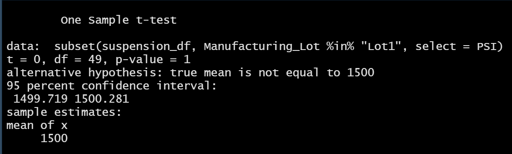
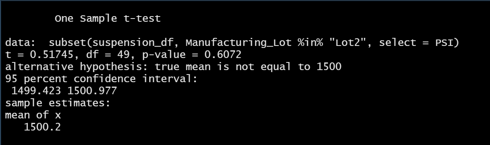
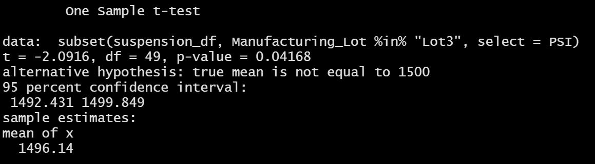

# MechaCar Statistical Analysis

## Linear Regression to Predict MPG

1. Which variables/coefficients provided a non-random amount of variance to the mpg values in the dataset?
* The three variables that provided a significant amount of variance are **ground_clearance** and vehicle_length.    We also see a significant intercept, which might indicate the need for further analysis (possibly transforming/scaling variables or introducing other variables not covered here). 

2. Is the slope of the linear model considered to be zero? Why or why not?
* Though we do not visualize multiple linear regressions with a single slope as we would for a simple regression, our strong correlations with multiple variables indicate that we would not consider the slope of this linear model to be zero. 

3. Does this linear model predict the mpg of MechaCar prototypes effectively? Why or why not?
* Yes, this linear model effectively predicts mpg. We can see this in the p-value of our summary: our alpha was 0.05 and our p-value far surpassed this threshold with a p-value of 5.35e-11 (standard notation: 0.0000000000535). However, as covered in point 1, the small sample size of 50 cars tempers the model's predictive strength. 

## Summary Statistics on Suspension Coils

### Total Summary 
   

### Lot Summary 
   

1. The design specifications for the MechaCar suspension coils dictate that the variance of the suspension coils must not exceed 100 pounds per square inch. Does the current manufacturing data meet this design specification for all manufacturing lots in total and each lot individually? Why or why not?

* No, the current manufacturing data does not meet this specification. For the total summary, we do see a variance that falls within the acceptable range for this guideline (62 PSI). Lot 1 (1 PSI) and Lot 2 (8 PSI) also meet the specification. However, Lot 3 has a variance that does not meet the specification at 170 PSI. Lot 3 skewed the total summary variance so that it is not representative of the overall variance in manufacturing.

## T-Tests on Suspension Coils
To dig further into the statistical difference in the mean PSI of our data compared to the population mean, I ran four t-tests: one on the overall mean from all lots as well as individual tests for each lot.  

The findings, as seen in the screenshots below, show that the **overall mean and Lot 1's mean are statistically the same** as the population mean (p-value: 1); **Lot 2's mean is statistically similar** to the population mean (p-value: 0.61); and **Lot 3's mean is statistically different** from the population mean (p-value: 0.04). With an alpha of 0.05, Lot 3's p-value of 0.04 doesn't represent an extreme difference, though it still falls within statistically significant bounds. This analysis confirms the issue with the variance in Lot 3's mean PSI.   

### Lot 1 T-Test
   

### Lot 2 T-Test
   

### Lot 3 T-Test 
   

## Study Design: MechaCar vs Competition

* What metric or metrics are you going to test?

* What is the null hypothesis or alternative hypothesis?

* What statistical test would you use to test the hypothesis? And why?

* What data is needed to run the statistical test?

